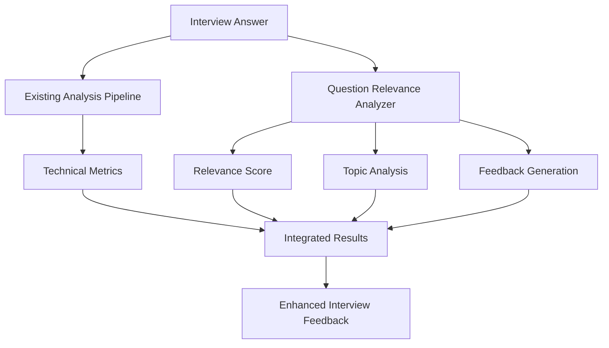

# Design Document

## Overview

The Question Relevance Analysis feature addresses a critical gap in the current AI Interview Practice System. While the system provides excellent technical analysis (speaking pace, grammar, confidence), it fails to evaluate whether answers actually address the questions asked. This enhancement adds semantic analysis to ensure users receive meaningful feedback about their ability to stay on topic during interviews.

The system will analyze the semantic similarity between interview questions and user answers, providing relevance scores, classifications, and specific feedback to help users improve their question-answering skills.

## Architecture

### High-Level Architecture



### Integration Points

The Question Relevance Analysis integrates with the existing interview system at three key points:

1. **Input Processing**: Receives the same question and transcript data as existing analysis
2. **Analysis Pipeline**: Runs in parallel with existing speech analysis
3. **Results Integration**: Combines relevance analysis with existing metrics for unified feedback

## Components and Interfaces

### 1. Question Relevance Analyzer

**Purpose**: Core component that performs semantic analysis between questions and answers.

**Interface**:
```python
class QuestionRelevanceAnalyzer:
    def analyze_relevance(self, question: str, answer: str) -> RelevanceResult
    def classify_question_type(self, question: str) -> QuestionType
    def extract_topics(self, text: str) -> List[Topic]
    def detect_topic_drift(self, question_topics: List[Topic], answer_topics: List[Topic]) -> TopicDrift
```

**Key Methods**:
- `analyze_relevance()`: Main analysis method returning comprehensive relevance assessment
- `classify_question_type()`: Identifies question category (behavioral, technical, personal, etc.)
- `extract_topics()`: Extracts key topics and concepts from text
- `detect_topic_drift()`: Identifies when answers drift away from question topics

### 2. Semantic Similarity Engine

**Purpose**: Calculates semantic similarity between question and answer content using NLP techniques.

**Interface**:
```python
class SemanticSimilarityEngine:
    def calculate_similarity(self, text1: str, text2: str) -> float
    def get_sentence_embeddings(self, text: str) -> np.ndarray
    def find_semantic_overlap(self, question: str, answer: str) -> SemanticOverlap
```

**Implementation Approach**:
- Use sentence transformers for semantic embeddings
- Calculate cosine similarity between question and answer embeddings
- Identify overlapping concepts and themes

### 3. Question Pattern Matcher

**Purpose**: Maintains knowledge base of interview question patterns and expected answer structures.

**Interface**:
```python
class QuestionPatternMatcher:
    def match_pattern(self, question: str) -> QuestionPattern
    def get_expected_elements(self, pattern: QuestionPattern) -> List[ExpectedElement]
    def validate_answer_structure(self, answer: str, pattern: QuestionPattern) -> StructureValidation
```

**Question Patterns**:
- **Behavioral**: Expects STAR method (Situation, Task, Action, Result)
- **Technical**: Expects technical concepts, methodologies, examples
- **Personal**: Expects background, experience, goals
- **Value Proposition**: Expects skills, achievements, company fit

### 4. Feedback Generator

**Purpose**: Creates specific, actionable feedback based on relevance analysis results.

**Interface**:
```python
class FeedbackGenerator:
    def generate_relevance_feedback(self, result: RelevanceResult) -> RelevanceFeedback
    def create_improvement_suggestions(self, question: str, answer: str, score: float) -> List[Suggestion]
    def generate_examples(self, question: str, question_type: QuestionType) -> List[Example]
```

**Feedback Types**:
- **Positive Reinforcement**: For high relevance scores (80%+)
- **Targeted Improvement**: For medium relevance scores (60-79%)
- **Comprehensive Guidance**: For low relevance scores (<60%)

## Data Models

### RelevanceResult

```python
@dataclass
class RelevanceResult:
    relevance_score: float  # 0-100
    classification: RelevanceClassification
    question_type: QuestionType
    semantic_similarity: float
    topic_overlap: TopicOverlap
    topic_drift: Optional[TopicDrift]
    missing_elements: List[ExpectedElement]
    feedback: RelevanceFeedback
    processing_time: float
```

### RelevanceClassification

```python
class RelevanceClassification(Enum):
    HIGHLY_RELEVANT = "Highly Relevant"      # 80-100%
    MOSTLY_RELEVANT = "Mostly Relevant"      # 60-79%
    PARTIALLY_RELEVANT = "Partially Relevant" # 40-59%
    MINIMALLY_RELEVANT = "Minimally Relevant" # 20-39%
    OFF_TOPIC = "Off-Topic"                  # 0-19%
```

### QuestionType

```python
class QuestionType(Enum):
    BEHAVIORAL = "behavioral"
    TECHNICAL = "technical"
    PERSONAL = "personal"
    VALUE_PROPOSITION = "value_proposition"
    STRENGTHS_WEAKNESSES = "strengths_weaknesses"
    SITUATIONAL = "situational"
    GENERAL = "general"
```

### TopicOverlap

```python
@dataclass
class TopicOverlap:
    shared_topics: List[str]
    question_only_topics: List[str]
    answer_only_topics: List[str]
    overlap_percentage: float
```

### RelevanceFeedback

```python
@dataclass
class RelevanceFeedback:
    summary: str
    strengths: List[str]
    improvements: List[str]
    specific_suggestions: List[str]
    example_elements: List[str]
    priority_level: FeedbackPriority
```

## Correctness Properties

*A property is a characteristic or behavior that should hold true across all valid executions of a system-essentially, a formal statement about what the system should do. Properties serve as the bridge between human-readable specifications and machine-verifiable correctness guarantees.*

### Property Reflection

After reviewing all properties identified in the prework analysis, several can be combined for more comprehensive testing:

- Properties 2.1-2.5 (classification ranges) can be combined into one comprehensive classification property
- Properties 4.1-4.5 (question-specific analysis) can be combined into one question type analysis property  
- Properties 8.1-8.5 (adaptive feedback) can be combined into one adaptive feedback property

This eliminates redundancy while ensuring complete coverage of the requirements.

### Core Properties

**Property 1: Relevance Score Validity**
*For any* question and answer pair, the relevance score should always be between 0 and 100 inclusive
**Validates: Requirements 1.2**

**Property 2: Classification Consistency**
*For any* relevance score, the classification should match the defined ranges: 80-100% = "Highly Relevant", 60-79% = "Mostly Relevant", 40-59% = "Partially Relevant", 20-39% = "Minimally Relevant", 0-19% = "Off-Topic"
**Validates: Requirements 2.1, 2.2, 2.3, 2.4, 2.5**

**Property 3: Semantic Analysis Completeness**
*For any* question-answer pair, semantic analysis should identify topics in both question and answer, calculate similarity, and detect topic drift when present
**Validates: Requirements 1.1, 1.3, 1.4**

**Property 4: Performance Constraint**
*For any* transcript input, relevance analysis should complete within 3 seconds
**Validates: Requirements 1.5**

**Property 5: Question Type Analysis**
*For any* interview question, the analyzer should correctly identify question type and look for appropriate elements (STAR method for behavioral, technical concepts for technical, background for personal, etc.)
**Validates: Requirements 4.1, 4.2, 4.3, 4.4, 4.5, 6.1, 6.2, 6.3, 6.4**

**Property 6: Feedback Completeness**
*For any* analysis result, the system should provide feedback that includes relevance score, classification, specific suggestions, and examples appropriate to the question type
**Validates: Requirements 2.6, 3.4, 3.5**

**Property 7: Adaptive Feedback Intensity**
*For any* relevance score, feedback detail should increase as relevance decreases: brief feedback for 80%+, moderate for 60-79%, detailed for <60%
**Validates: Requirements 8.1, 8.2, 8.3, 8.4, 8.5**

**Property 8: Integration Preservation**
*For any* interview analysis, all existing features (confidence, WPM, grammar, emotion) should continue working while relevance analysis is added
**Validates: Requirements 5.1, 5.4, 7.1**

**Property 9: Topic Drift Detection**
*For any* answer that discusses topics not present in the question, the system should detect and report the specific off-topic content
**Validates: Requirements 3.2, 3.3**

**Property 10: Performance Rating Adjustment**
*For any* interview analysis with relevance score below 60%, the overall performance rating should be adjusted to reflect poor question addressing
**Validates: Requirements 5.2, 5.3**

**Property 11: Data Persistence**
*For any* interview session, relevance scores and feedback should be stored in the database and retrievable for progress tracking
**Validates: Requirements 5.5, 7.5**

**Property 12: UI Integration**
*For any* interview result display, relevance information should appear alongside existing metrics with appropriate color coding and formatting
**Validates: Requirements 7.2, 7.3, 7.4**

## Error Handling

### Input Validation
- **Empty Question/Answer**: Return appropriate error message and default low relevance score
- **Invalid Text Encoding**: Handle encoding issues gracefully with fallback analysis
- **Extremely Long Text**: Truncate or chunk text to prevent performance issues

### Analysis Failures
- **Semantic Model Unavailable**: Fall back to keyword-based similarity analysis
- **Topic Extraction Failure**: Provide basic relevance scoring without detailed topic analysis
- **Timeout Conditions**: Return partial results with performance warning

### Integration Errors
- **Database Save Failure**: Continue with analysis display, log error for debugging
- **UI Rendering Issues**: Ensure core relevance data is always displayed even if formatting fails

## Testing Strategy

### Dual Testing Approach
The system requires both unit tests and property-based tests for comprehensive coverage:

**Unit Tests** focus on:
- Specific question-answer pairs with known expected results
- Edge cases like empty inputs, very short/long texts
- Integration points with existing interview system
- Error conditions and fallback behaviors

**Property Tests** focus on:
- Universal properties that hold across all question-answer combinations
- Performance characteristics under various input conditions
- Consistency of classification and scoring algorithms
- Robustness across different question types and answer styles

### Property Test Configuration
- **Minimum 100 iterations** per property test due to randomization
- **Test data generation** covering all question types and relevance levels
- **Performance monitoring** to ensure 3-second constraint is maintained
- **Integration testing** with existing interview analysis pipeline

Each property test will be tagged with: **Feature: question-relevance-analysis, Property {number}: {property_text}**

### Test Data Strategy
- **Curated Question Bank**: Representative questions from each category
- **Answer Variations**: High, medium, and low relevance answers for each question
- **Edge Cases**: Off-topic answers, very brief answers, overly long answers
- **Real Interview Data**: Anonymized real interview responses for validation